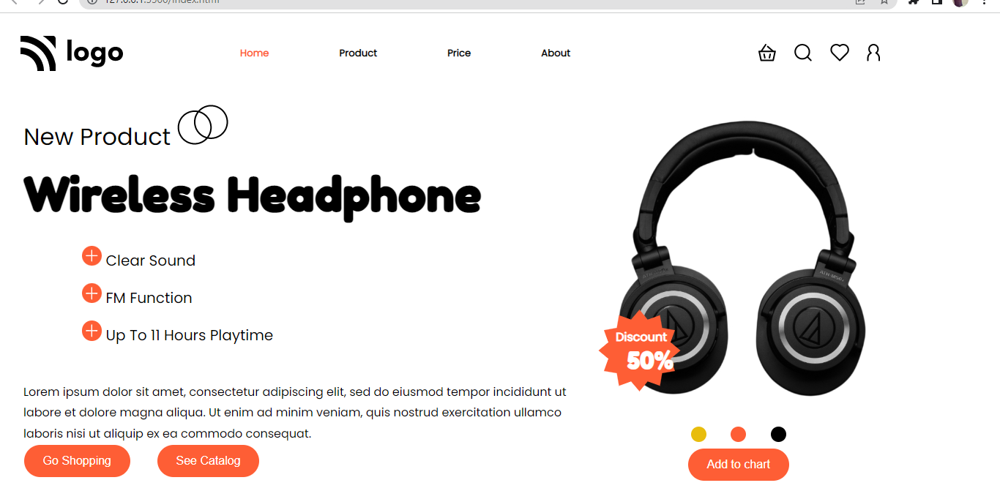

  
  
  
  
  ## Live
  [Netlify](https://product-homepage-home.netlify.app/)

 # Product Homepage
In this Product Homepage project, I use HTML  paragraphs, headings, ids, and classes to target HTML elements effectively. In CSS I used flexbox for creating navbar positions to set an element in DOM. A big Thanks to Hitesh Choudhary sir and Ineuron who gave me the opportunity to learn and grow.

# I used:
HTML
CSS(Media quries)

# Screenshot.

# Credits.
A big thanks to the Hitesh choudhary and Inueron which gave a Oppurtunity to learn and grow.
